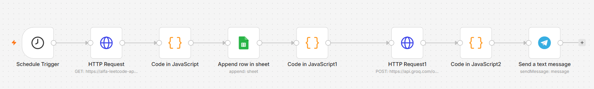
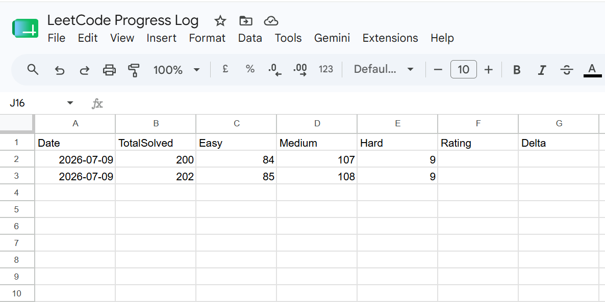

# LeetCode Prep Auto-Tracker

An agentic automation pipeline that tracks daily LeetCode progress, uses an
LLM to generate personalized practice recommendations based on known weak
topic areas, and delivers a daily digest via Telegram — built to support
structured DSA interview prep ahead of SDE campus placements.

## Architecture

## Tech Stack

- **n8n** (self-hosted) — workflow orchestration
- **Custom LeetCode Stats API** — forked and deployed from [alfa-leetcode-api](https://github.com/alfaarghya/alfa-leetcode-api), hosted on Render
- **Google Sheets API** — progress history log
- **Groq API (Llama 3.3 70B)** — weak-area analysis & recommendation generation
- **Telegram Bot API** — daily digest delivery
- **Docker** — containerized deployment

## How it works

1. A scheduled trigger fires daily and fetches live LeetCode stats via a
   self-hosted REST API
2. Stats are parsed and appended as a new row to a Google Sheet, building a
   historical progress log over time
3. An LLM (Llama 3.3 70B via Groq) analyzes the day's stats alongside known
   weak areas (Dynamic Programming, Graphs/Trees, OOP, SQL) and generates
   3 targeted problem recommendations plus a study tip
4. The recommendation is delivered directly to Telegram — no manual
   tracking or lookup required

## Sample output

**Telegram digest:**

**Progress log:**

## Setup

1. Deploy the LeetCode stats API (see `/api`, or use your own fork of
   [alfa-leetcode-api](https://github.com/alfaarghya/alfa-leetcode-api))
2. Copy `.env.example` to `.env` and fill in your own values
3. Import `workflow/leetcode-tracker.json` into your n8n instance
4. Configure credentials in n8n:
   - Google Sheets (service account)
   - Groq (header auth, `Authorization: Bearer <key>`)
   - Telegram (bot token)
5. Activate the workflow

## Why this project

Built to eliminate manual progress tracking during an intensive DSA
interview-prep cycle, while exploring agentic workflow design — using an
LLM not just to generate text, but to reason over structured data and
produce targeted, personalized action items on a recurring schedule.